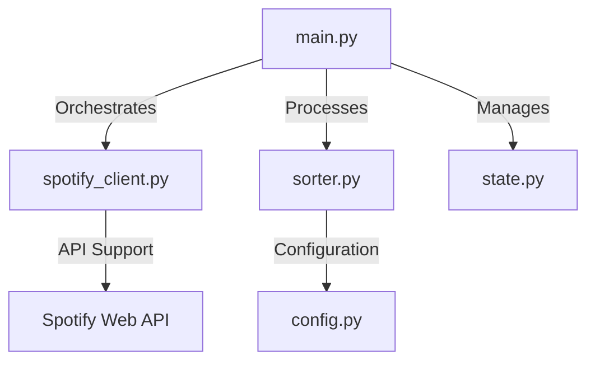

# Spotify Auto-Sorter 🎵

A robust, automated utility designed to organise your "Liked Songs" into genre-specific playlists. Engineered for high reliability, it navigates the technical challenges of the 2026 Spotify API landscape using intelligent synchronisation and fallback logic.

## 🚀 Key Features

-   **Intelligent Synchronisation**: Categorises tracks based on artist and album metadata using a customisable priority system.
-   **Incremental Updates**: Leverages `state.json` to process only new additions, minimising API overhead and ensuring efficient performance.
-   **2026 API Compliance**: Engineered to handle deprecated endpoints and unreliable genre data through sophisticated fallback strategies.
-   **Safe Deployment**: Appends tracks to playlists non-destructively, preserving any manual modifications you have made.
-   **Fully Automated**: Optimised for daily execution via GitHub Actions.

---

## 🏗️ Technical Architecture

The system is built on a modular architecture to ensure maintainability and scalability:



-   **`main.py`**: The application's entry point, managing the high-level workflow and error handling.
-   **`spotify_client.py`**: A dedicated API abstraction layer that manages authentication, batching, and deprecation fallbacks.
-   **`sorter.py`**: The core logic engine that performs keyword-based classification and bucket prioritisation.
-   **`config.py`**: Centralises all configuration, including complex genre mappings and preference toggles.
-   **`state.py`**: Handles the persistence of synchronisation metadata to enable incremental processing.

---

## 🧠 Solved Challenges

### 1. Robust Genre Detection
With the evolution of Spotify's metadata in 2026, artist-level genres have become less reliable. This project implements a **layered lookup strategy**: if artist data is insufficient, it automatically falls back to album-level metadata to ensure accurate categorisation.

### 2. API Resilience
To address the removal of several standard endpoints, the client uses a **dynamic request dispatcher**. It identifies and avoids legacy endpoints, such as the direct user-playlist creation routes, in favour of the modern `/me/playlists` architecture.

### 3. Performance & Rate Limiting
Managing large libraries requires careful API handling. The system uses **intelligent batching** for all metadata retrieval and playlist updates, ensuring stay well within Spotify's rate limits while maintaining high throughput.

---

## 🛠️ Installation & Setup

### 1. Prerequisites
-   **Spotify Premium Account**: Required for API dashboard access as of February 2026.
-   **Python 3.9+**: The project relies on modern Python features for stability.

### 2. Local Setup
1.  Clone the repository and install the required dependencies:
    ```bash
    pip install -r requirements.txt
    ```
2.  Configure your credentials in a `.env` file (`SPOTIPY_CLIENT_ID` and `SPOTIPY_CLIENT_SECRET`).
3.  Execute the authentication helper to generate your long-lived refresh token:
    ```bash
    python auth_helper.py
    ```
    
---

## 🧪 Verification
The included test suite provides comprehensive coverage of the sorting and prioritisation logic:
```bash
pytest test_sorter_logic.py
```

## 🔒 Security & Privacy
-   **Credential Isolation**: Sensitive tokens are managed via environment variables and local cache, strictly excluded from version control via `.gitignore`.
-   **Auditability**: Use `DRY_RUN = True` in `config.py` to preview all actions without affecting your Spotify library.

---

## 📄 Licence
This project is licensed under the **MIT Licence**. You are free to use, modify, and distribute the software, provided the original copyright notice is retained. See the [LICENSE](LICENSE) file for the full legal text.