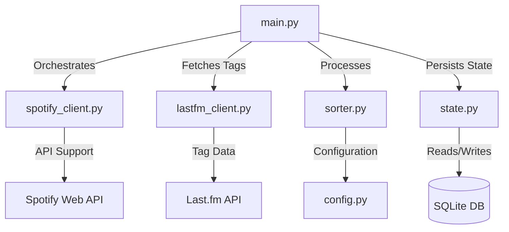

# Spotify Auto-Sorter 🎵

A robust, automated utility designed to organise your "Liked Songs" into genre-specific playlists. Engineered for high reliability, it navigates the technical challenges of the 2026 Spotify API landscape using intelligent synchronisation and external metadata integration.

## 🚀 Key Features

-   **Precision Tagging**: Categorises tracks based on specific song-level tags fetched via the **Last.fm API**, with an intelligent fallback to artist-level metadata.
-   **SQLite Database**: Leverages `state.db` to create a persistent memory of the processed tracks, unclassified tracks, and errors. Also processes only new additions, minimising API overhead and ensuring efficient performance.
-   **2026 Spotify API Compliance**: Engineered to handle the changes made to the **Spotify Web API in 2026**, including deprecated endpoints and removed genre fields through direct REST calls and modern auth patterns.
-   **Guaranteed Resilience**: Uses a **Single-Item Processing** strategy to bypass aggressive Web Application Firewalls (WAF) and batch request failures.
-   **Safe Deployment**: Appends tracks to playlists non-destructively, preserving any manual modifications you have made.

---

## 🏗️ Technical Architecture

The system is built on a modular architecture to ensure maintainability and scalability:



-   **`main.py`**: The application's entry point, managing the high-level workflow, caching, and error handling. It now supports multi-playlist assignment for tracks.
-   **`spotify_client.py`**: A dedicated API abstraction layer. Uses **batched requests** (100 items/call) to the modern `/v1/playlists/{id}/items` endpoint for maximum performance.
-   **`lastfm_client.py`**: Interface for the Last.fm API. Fetched tags are now **cached in SQLite**, preventing redundant API calls.
-   **`sorter.py`**: The core logic engine that performs keyword-based classification.
-   **`config.py`**: Centralises all configuration, including complex genre mappings and API credentials.
-   **`state.py`**: Manages the local SQLite database (`state.db`). This database tracks:
    -   Last run timestamp (for incremental sync).
    -   Processed track URIs (to prevent duplicates).
    -   Playlist snapshots (to detect external changes).
    -   Artist Tag Cache (to minimise Last.fm usage).

---

## 🧠 Solved Challenges

### 1. External Genre Detection & Caching
Spotify has deprecated standard genre fields. We use **Last.fm** as a primary metadata source. To respect API limits and improve speed, all fetched artist tags are **cached in a local SQLite database**. This means the script gets faster the more you use it.

### 2. Multi-Genre Sorting
Standard sorters often pick the "first match". Our system intelligently assigns a single track to **multiple playlists** if it matches multiple genres (e.g., a "Rock" song that fits "Workout" vibes will go to both), ensuring a comprehensive library organization.

### 3. Rate Limiting & API Compliance
The application uses a dual-layer strategy to comply with Spotify and Last.fm API limits, ensuring long-running syncs (like an 8,000+ song initial migration) complete without being banned.

-   **Proactive: Leaky Bucket Algorithm**: 
    -   Every request is governed by a `LeakyBucket` rate limiter in `rate_limiter.py`. 
    -   **Spotify**: Set to a very low safety limit (e.g., 1 request per 30 seconds with 10 - 20% jitter) to avoid rate limits.
    -   **Last.fm**: Uses a faster leaking bucket (5 requests per second) to process genres quickly but safely.
    -   **Enforced Spacing**: The code enforces spacing between individual API calls rather than creating large bursts of calls followed by silence. This mimics human behaviour and avoids triggering rate limits.
-   **Reactive: HTTP Adapter & Retries**: 
    -   A custom `RateLimitAdapter` is mounted to the `requests` session.
    -   If an API returns an **HTTP 429 (Too Many Requests)**, the adapter automatically extracts the `Retry-After` header, pauses execution, and retries once it is safe.
    -   Implements **Exponential Backoff** for standard network errors (500, 502, 503, 504).

### 4. Batch Efficiency
To handle large libraries:
-   **Bulk Updates**: Tracks are added to playlists in groups of 100 per request.
-   **State Tracking**: We track `snapshot_id`s to avoid re-scanning playlists that haven't changed.
-   **Incremental Sync**: Processed tracks are logged in SQLite, allowing the script to resume exactly where it left off if interrupted.

---

## 🛠️ Installation & Setup

### 1. Prerequisites
-   **Spotify Premium Account**
-   **Last.fm API Account**
-   **Python 3.9+**

### 2. Local Setup
1.  Clone the repository and install the required dependencies:
    ```bash
    pip install -r requirements.txt
    ```
2.  Configure your credentials in a `.env` file (see `.env.example`):
    ```env
    SPOTIPY_CLIENT_ID=...
    SPOTIPY_CLIENT_SECRET=...
    SPOTIPY_REFRESH_TOKEN=...
    LASTFM_API_KEY=...
    SPOTIPY_REDIRECT_URI=http://127.0.0.1:8888/callback
    ```
3.  Execute the authentication helper to generate your Spotify refresh token:
    ```bash
    python auth_helper.py
    ```
    
---

## 🧪 Verification
The dry-run mode provides testing ability without actually modifying your playlists:
```bash
# Perform a safe dry run (config.DRY_RUN = True)
python main.py
```

## 🔒 Security & Privacy
-   **Credential Isolation**: Sensitive tokens are managed via environment variables and local cache.
-   **State Persistence**: `state.db` is tracked in git (excluding temporary WAL files) to allow GitHub Actions to maintain state between runs.

---

## 📄 Licence
This project is licensed under the **MIT Licence**. See the [LICENSE](LICENSE) file for details.
