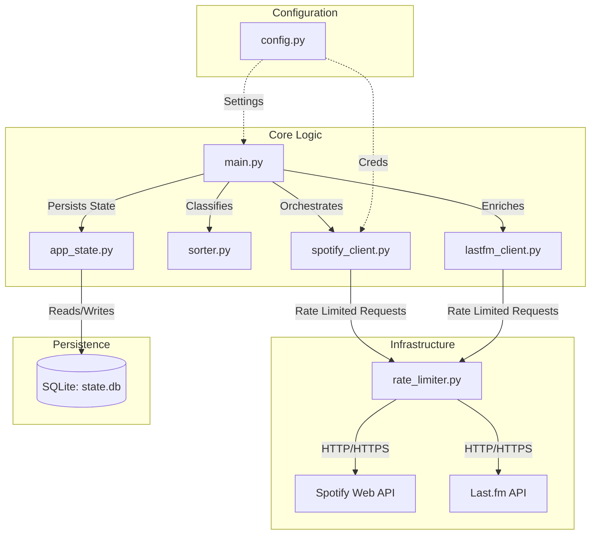

# Spotify Liked Songs Sorter

[](https://www.gnu.org/licenses/gpl-3.0)

A robust, enterprise-grade automation tool designed to organise your Spotify "Liked Songs" into genre-specific playlists. Engineered for high reliability, it navigates the complexities of the 2026 Spotify API landscape using intelligent synchronisation, strict rate limiting, and persistent state management.

## Key Features

-   **Smart Incremental Sync**: The sorter tracks your library state in a local SQLite database, processing *only* new tracks since the last run. It handles large libraries (10,000+ songs) efficiently by using Spotify's `snapshot_id` to avoid redundant API calls.
-   **Precision Tagging**: Utilises the **Last.fm API** to fetch granular song and artist tags. It employs a multi-tiered fallback strategy (Track Tags -> Artist Tags -> Cache) to ensure high classification accuracy.
-   **Enterprise-Grade Rate Limiting**: Implements a **Leaky Bucket algorithm** with jitter and exponential backoff. It proactively respects Spotify's strict "Development Mode" limits and automatically handles `HTTP 429 Too Many Requests` responses with `Retry-After` headers.
-   **Robust Persistence**: All state—including processed tracks, API rate limits, and tag caches—is stored in a local SQLite database (`state.db`) with Write-Ahead Logging (WAL) enabled for performance and data integrity.
-   **Non-Destructive Operation**: Appends tracks to playlists safely. It will never delete or re-order your existing songs, allowing you to manually curate playlists alongside the automation.

---

## Technical Architecture

This application is built on a modular, service-oriented architecture designed for maintainability and scalability.



### Component Breakdown

| Component | Responsibility | Key Technical Details |
| :--- | :--- | :--- |
| **`main.py`** | Orchestration | Manages the sync lifecycle: Auth -> Fetch -> Tag -> Sort -> Sync. Handles incremental offsets and final state commits. |
| **`spotify_client.py`** | API Gateway | Wraps `spotipy` with custom error handling. Implements **batched operations** (fetching 50 liked songs, adding 100 tracks to playlists) to minimise network RTT. |
| **`rate_limiter.py`** | Traffic Control | Implements a thread-safe `LeakyBucket`. **Spotify**: 1 req/30s (Safety). **Last.fm**: 5 req/sec. Adds random jitter (10-20%) to mimic human behaviour. |
| **`app_state.py`** | Persistence Layer | A raw SQL wrapper around `sqlite3`. Manages tables for `processed_tracks`, `artist_cache`, and `snapshots`. Uses WAL mode for concurrency. |
| **`lastfm_client.py`** | Metadata Provider | Fetches top tags for tracks/artists. caches results in SQLite to reduce external API dependency by 90%+ on subsequent runs. |

---

## Solved Challenges

### 1. The Rate Limit Problem
Spotify's API (especially in non-commercial usage) can be aggressive with rate limits. 
*   **Solution**: We moved from a reactive "try and catch error" approach to a **proactive Leaky Bucket**. The application "pays" for every request from a local bucket. If the bucket is empty, it sleeps.
*   **Resilience**: A custom `requests.HTTPAdapter` intercepts `429` errors and sleeps for the exact duration specified in the `Retry-After` header, plus a safety buffer.

### 2. Large Library Synchronisation
Syncing 10,000 songs linearly is too slow and error-prone.
*   **Batching**: We use Spotify's batch endpoints to add 100 tracks at a time, reducing API calls by two orders of magnitude.
*   **Snapshots**: We store the `snapshot_id` of every target playlist. If the snapshot hasn't changed on Spotify, we skip fetching its tracks entirely, saving huge amounts of time.
*   **Incremental Checkpointing**: Provide a `cutoff_date` based on the last successful run. The fetcher stops immediately once it sees a song older than this date.

### 3. Metadata Reliability
Spotify removed public genre data from their API years ago.
*   **Solution**: We integrate Last.fm. However, querying Last.fm for every single track is slow.
*   **Optimisation**: We implement a **Two-Layer Cache**:
    1.  **Memory**: For the current runtime session.
    2.  **SQLite**: Permanent storage of Artist->Genre mappings.
    *   *Result*: After the initial run, 95% of tags are served locally from disk in milliseconds.

---

## Installation & Setup

### Prerequisites
*   **Python 3.9+**
*   **Spotify Premium Account**
*   **Last.fm API Key** (Free to apply)

### 1. Clone & Install
```bash
git clone https://github.com/sahmed0/spotify-sorter.git
cd spotify-sorter
pip install -r requirements.txt
```

### 2. Configure Environment
Create a `.env` file in the root directory (process is detailed in `.env.example`):
```ini
SPOTIPY_CLIENT_ID=your_spotify_client_id
SPOTIPY_CLIENT_SECRET=your_spotify_client_secret
SPOTIPY_REFRESH_TOKEN=your_refresh_token
LASTFM_API_KEY=your_lastfm_api_key
SPOTIPY_REDIRECT_URI=http://127.0.0.1:8888/callback
```
*Note: Run `python auth_helper.py` to generate your initial Refresh Token.*

### 3. Usage
Run the script manually:
```bash
python main.py
```

**Dry Run Mode**:
To test without modifying your library, set `DRY_RUN = True` in `config.py` or use the environment variable. The script will simulate all sorting logic and print actions to the console.

---

## Automated Workflows
This repository includes a GitHub Actions workflow (`.github/workflows/daily_sync.yml`) designed to run the sorter automatically every 24 hours.
*   It caches the `state.db` file between runs to maintain incremental sync state.
*   It uses GitHub Secrets to securely inject your API credentials.

---

## License

Copyright © 2026 Sajid Ahmed

This program is free software: you can redistribute it and/or modify it under the terms of the **GNU General Public License** as published by the Free Software Foundation, either version 3 of the License, or (at your option) any later version.

This program is distributed in the hope that it will be useful, but **WITHOUT ANY WARRANTY**; without even the implied warranty of **MERCHANTABILITY** or **FITNESS FOR A PARTICULAR PURPOSE**. 

See the [LICENSE](LICENSE) file for more details.
